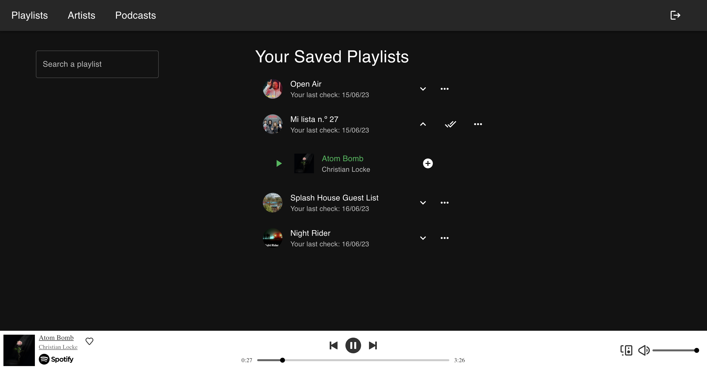

# Song Notify

I like keeping track of several Spotify Playlists and many times they add songs that I do not notice. I wanted to be able to play these songs while going in the car, doing sport and then if I liked them add them to any of my playlits, that's how this idea became an app.
The app is built using React, Express, and MongoDB, if you want to contribute send me a message and I help you out with the deployment!

Live version [here](https://new-song-notify.vercel.app/)

## Screenshots

## Features

- Connects with Spotify API to fetch user's playlists
- Allows users to monitor selected playlists for newly added songs
- Plays selected songs directly from the frontend of the app

## Tech Stack

- Frontend: React, Material-UI, Typescript
- Backend: Node.js, Express, Mongoose
- Database: MongoDB
- Hosting: Vercel (frontend), Render (backend)

## Deployment

This project has been deployed on two steps, the server on Render.com and the client on Vercel. Here are the two links:
Server: https://newsongnotify.onrender.com
Frontend: https://new-song-notify.vercel.app/
